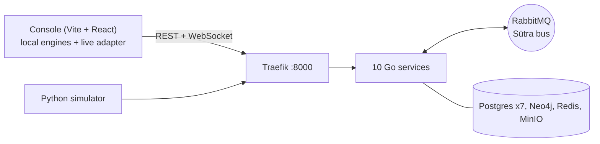

# NEXUS

**A coordination layer for multi-agency disaster response.** NEXUS is a digital twin of a district's response infrastructure:
the road network, hospitals, pharmacies, shelters, response units and the power, water and telecom lifelines. Every agency
publishes into one event bus (**Sūtra**) and reads from it. When a road breaks, a river rises or a substation fails, the effect
cascades through the graph: NEXUS reroutes ambulances, re-ranks hospitals and alerts the public. The control-room console is
**Sūtradhāra**; the pilot district is **Dehradun, Uttarakhand**. A B.Tech major project.



The console (`frontend/`) is complete on its own and **always runs without the backend**: its local engines take over
the moment the services are unreachable. With the backend up, the Topbar chip reads **Live** and SOS requests, road breaks,
hospital state and the rest are shared through the bus and the ten services.

## Quick start (macOS, Docker Desktop, Node 18+)

```bash
./scripts/start-all.sh          # gateway, databases, ten services, seed, then the console
```

The first run builds ten Go images (a few minutes). It prints the console URL (http://localhost:5173) and the gateway URL
(http://localhost:8000; if another program holds 8000 it picks the next free port and tells you). Then:

```bash
./scripts/smoke.sh --e2e        # health, readiness, every read endpoint, and one SOS end to end
./scripts/stop-all.sh           # stop (data kept); add --clean to wipe databases and queues
./scripts/start-all.sh --build  # rebuild the images; --clean starts from empty databases; --no-frontend skips the console
```

**Separate Citizen and City-admin access.** `./scripts/start-all.sh --secure` turns demo tokens off: the console asks for a sign-in, and the script
prints the three accounts (`controller@`, `responder@`, `citizen@nexus.local`) and the console's address on your Wi-Fi. Open that address on a phone
and sign in as the citizen: it sees only the SOS screen, and its token is refused by every operational endpoint. Sign in as the controller on the
laptop to watch the SOS arrive. `--demo` (the default) brings back the instant role switch for rehearsals.

Without Docker, the console alone still works: `cd frontend && npm install && npm run dev` (the chip reads **Local**).

Passwords and secrets are generated into `.env` (gitignored) on first start. Each service has a `.env.example`.

## The demo (about 8 minutes)

1. `./scripts/start-all.sh`, open the console. The Topbar chip says **Live**.
2. **Architecture**, press *Trace one SOS*.
3. Role menu: **Citizen**. Hold the SOS button, choose *Trapped*, *4*, injured *Yes*, send. The phone says help is assigned
   within a second. Switch back to **Controller**: *Incidents* shows the request with an ambulance, and *Hospitals* shows the
   best hospital chosen on reach, capacity, specialty and inbound load.
4. **Routes**: plan a route, press *Break* beside a step. It reroutes and states the difference. Then *Start the race*.
5. In a terminal: `python3 tools/simulator/main.py chaos --asset sub-01`. After a few seconds the substation fails.
   **Infrastructure** shows the cascade; the hospitals that lost power go into divert, a public alert is issued, and the
   next SOS is routed to a hospital that still has power. (*Restore utilities* heals everything.)
6. **Early warning**: drag the rainfall what-if, or run `python3 tools/simulator/main.py monsoon` for a 3-minute storm.
   Roads close at 80 mm and 150 mm, the flood spreads, routes change.
7. **Citizen** again: *Cut the network*, send an SOS (it is held on the device), *Peer finds an uplink* (it is delivered).
8. `./scripts/stop-all.sh`. The chip flips to **Local** and everything above still works on the local engine.
9. **Audit trail** shows the console's side of the record; `GET /api/v1/events` shows the server's
   (`curl -s -H "Authorization: Bearer $TOKEN" localhost:8000/api/v1/events`, see [docs/api.md](docs/api.md)). Open
   **Situation report** and print it.

Simulator modes: `telemetry`, `sos-burst --n 10`, `chaos --asset <id>`, `monsoon` (`python3 tools/simulator/main.py --help`;
`pip install -r tools/simulator/requirements.txt` once). Everything it sends is tagged `simulated`.

## What is real and what is simulated

Real, with a named source (the console's Sources screen lists them): hospital names, places and phones; pharmacy names,
addresses and hours; flood-prone localities; landslide points; the infrastructure register; replay incidents and closures
for 20 Jul 2026, 16 Sep 2025 and 20 Aug 2022; documented rainfall, river status and flood zoning; the **OpenStreetMap road network**
of the district (about 167,500 junctions).

Simulated, and labelled so on screen and in every envelope (`source`): free beds and inbound load, pharmacy stock, ambulances and
response teams, shelters and occupancy, SOS requests, **all power, water and telecom assets and their dependencies**, everything the
simulator sends, the flood spread, and the rainfall thresholds. The Evaluation screen reports simulation results, not field results.

## Layout

```text
frontend/        the Sūtradhāra console (Vite 5, React 18, MapLibre GL); src/api/ is the backend adapter
gateway/         Traefik, RabbitMQ, MinIO, Redis; creates the Docker network nexus-net
services/        shared/ (Go module: envelope, bus, httpx, auth, pg, seed, ratelimit) and the ten services
tools/seed/      export-data.mjs turns frontend/src/data/index.js into JSON for every service; test fixture generators
tools/simulator/ the Python simulator
tools/infra/     gen-compose.py regenerates the Dockerfiles and compose files
scripts/         start-all, stop-all, seed, smoke
docs/            architecture, api, events, decisions
```

| Service | Owns |
|---|---|
| identity-access | roles, JWT, demo tokens |
| graph-engine | road graph and A\* routing, reach, evaluation sweep, lifeline topology and cascade (Neo4j) |
| iot-broker | telemetry ingest, the bus-to-WebSocket fan-out, the event log |
| predictive-analytics | rainfall to road passability inference, the evaluation endpoint |
| traffic-control | closures, reported breaks, repairs |
| environmental-monitor | rainfall, rivers, flood zones, landslides, flood stage |
| emergency-dispatch | hospitals and allocation, units, shelters, pharmacies, the dispatch orchestrator |
| citizen-reporting | SOS, incidents, hazard reports |
| media-storage | report attachments (MinIO) |
| notification-gateway | CAP-style public alerts in English and Hindi, SMS fallback stub |

More: [architecture](docs/architecture.md), [API](docs/api.md), [events](docs/events.md), [decisions](docs/decisions.md),
[status](STATUS.md).

## Tests

```bash
cd services && for d in shared */; do (cd $d && go vet ./... && go test ./...); done   # unit tests per service
./scripts/smoke.sh --e2e                                                              # needs the stack running
cd frontend && npm run build && npm run preview & npx playwright test                 # the click-everything suite, see frontend/README.md
```

Notable tests: the Go A\* matches the console's `roadnet.js` on eleven fixed route pairs, lookups and a distance tree; the Go
evaluation sweep reproduces `simulation.js` exactly; the Go ports of `seedHosp` and `seedStock` reproduce the console's numbers; hospital ranking,
the cascade, the hazard inference, CAP alerts and the grace-period trigger have table tests.

## Team

Anuj Gandhi (services, infrastructure, integration) and a project partner (the Sūtradhāra console). Add names, guide and institution here.
