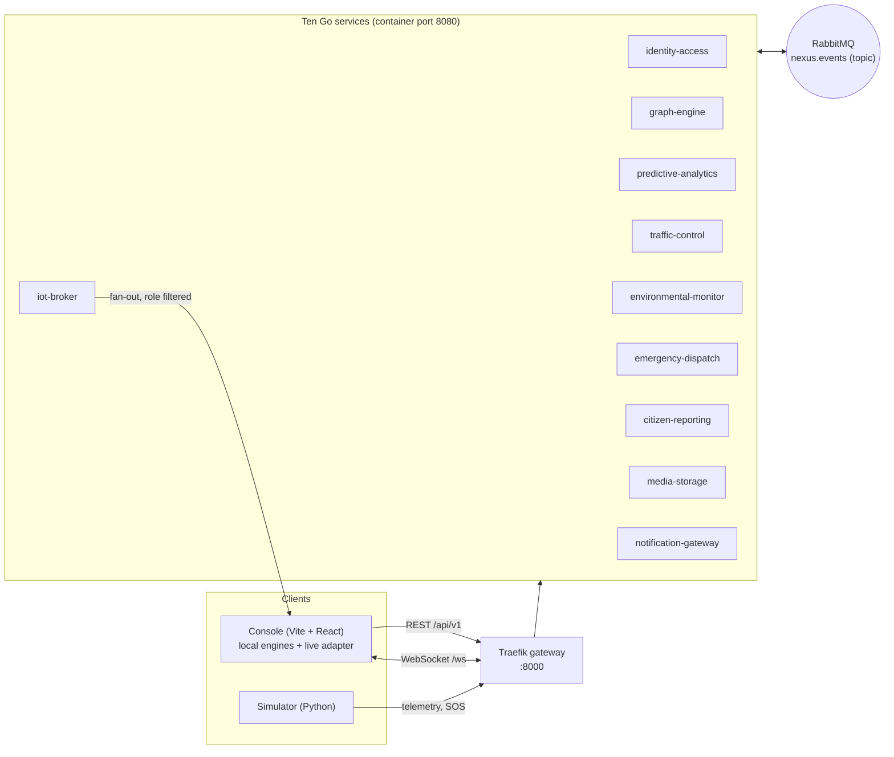
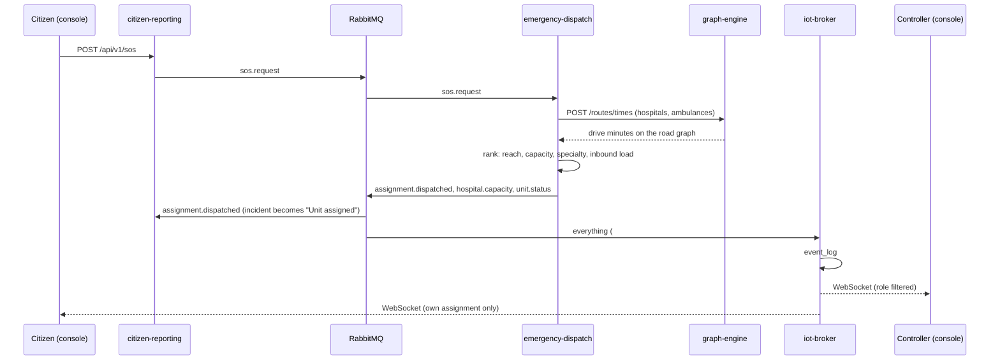
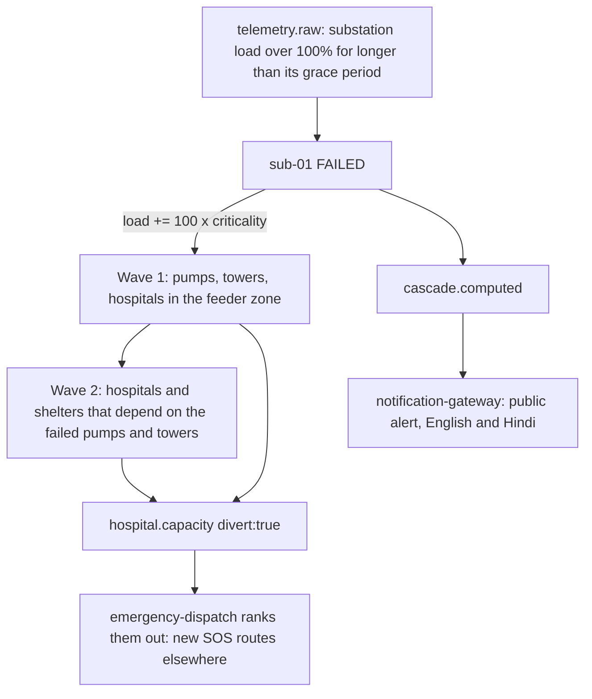

# Architecture

NEXUS is a coordination layer for multi-agency disaster response (pilot district: Dehradun). Every agency publishes into one
event bus, **Sūtra**, and reads from it. The control-room console is **Sūtradhāra**. Ten Go services own the ten domain
modules; the console works with or without them.

## The system

| Module | Service | Store |
|---|---|---|
| Roles, auth | identity-access | Postgres `identity` |
| Mārga routing, infrastructure graph, Prāṇadhārā cascade | graph-engine | Neo4j; road graph in memory |
| Sūtra edge: ingest, WebSocket, event log | iot-broker | Postgres `events` |
| Pūrvasūchanā inference, Evaluation sweep | predictive-analytics | Redis (cache) |
| Mārga closures, breaks, repairs | traffic-control | Postgres `traffic` |
| Rainfall, rivers, flood zones, flood stage | environmental-monitor | Postgres `environment` |
| Ārogya hospitals, Rakṣaka units, Āśraya shelters, pharmacies, dispatch | emergency-dispatch | Postgres `dispatch` |
| Āhvāna SOS, hazard reports, incidents | citizen-reporting | Postgres `reports` |
| Attachments | media-storage | MinIO `nexus-media` |
| Sūtradhāra public alerts (CAP, English and Hindi) | notification-gateway | Postgres `alerts` |

Shared infrastructure (Traefik, RabbitMQ, MinIO, Redis) lives in `gateway/`; every stack joins the Docker network `nexus-net`.
Each service keeps its own database on a private network. Prāṇadhārā lives in graph-engine as `Asset` nodes; Abhayasūchī and
Sambharaṇa are stubs under `/api/v1/dispatch/registry` and `/logistics`.

## One SOS, end to end

If the backend is unreachable, or the assignment does not come back within five seconds, the console runs the same logic
locally (`store.js`), so the demo never depends on the backend.

## The cascade (Prāṇadhārā)

## Routing

The road graph is loaded into memory on boot from `frontend/public/roads.json` (167,500 junctions and 168,323 segments of real
OpenStreetMap roads) or, if that file is missing, from the schematic `NODES`/`EDGES` in the console's datasets. The Go code
(`graph-engine/internal/domain/roadnet.go`) is an exact port of `frontend/src/engine/roadnet.js`: same graph build, grid
lookups, binary heap and A\* tie-breaking. A table test compares eleven fixed A to B pairs, the nearest-node and
nearest-edge lookups, a distance tree and the closure edge sets against the JS engine's output
(`services/graph-engine/testdata/routes.json`, generated by `tools/seed/gen-route-fixtures.mjs`). The Evaluation sweep is
ported the same way and tested against `testdata/eval.json`.

Road state (documented closures, reported breaks, the flood stage) is kept in step by `road_segment.*`, `flood.*` and
`scenario.*` events. A plan request can also carry its own picture, which the console does so that backend and local routes
are computed on the same inputs.

## Seed data

`frontend/src/data/index.js` is the single source of truth. `tools/seed/export-data.mjs` writes one JSON file per dataset to
`tools/seed/out/`, mounted read-only at `/seed` in every service, which seeds its store on first boot. The deterministic
simulated state (`seedHosp`, `seedStock`) is ported to Go and tested against the console's own output.

## Real versus simulated

Every dataset keeps the console's label. Real, with a named source: hospital names, places and phones; pharmacies; flood-prone
localities; landslide points; the infrastructure register; replay incidents and closures; documented rainfall, river status
and zoning; the OpenStreetMap road network. Simulated: free beds and inbound load, pharmacy stock, ambulances and teams,
shelters and occupancy, SOS requests, **all power, water and telecom assets and their dependencies**, every telemetry reading
from the simulator, the flood spread, and the rainfall thresholds. Envelopes carry `source` (`simulated`, `stub`, or a
producer name), and simulated assets carry `"source": "simulated"`.
